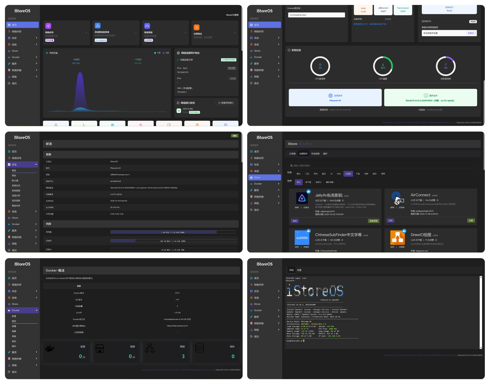

  
  <h1>基于imagebuilder与ophub打包工具的iStoreOS固件</h1>

  
  
  
  

  
  
  
  
  
  
  

---

## 🤔 项目介绍 
**iStoreOS** 目标是提供一个人人会用的路由兼轻 **NAS 系统** ，不管是作为路由还是 NAS，你都有相似的操作体验。

> [!TIP]
> 😂此固件为非官方构建，不保证完全无BUG，请知悉😂
> 
> 😂如果您对当前项目有抵触心理，欢迎您使用右侧项目😂👉👉👉[iStoreOS-Native](https://github.com/Kwonelee/iStoreOS-Native)
> 
> 使用此仓库必须设置机密token，Actions云构建固件时需要用到，通常在仓库设置里面。机密键名为 `GH_TOKEN`（严禁在仓库可视代码中填写，否则后果自负）

## 😅 第三方插件 

| 插件                     | 状态 | 插件                     | 状态  | 插件                   | 状态   |
|:------------------------:|:----:|:------------------------:|:-----:|:------------------------:|:----:|
| ramfree释放内存          | ✅   | openlist2                | ✅    | FileBrowser文件浏览器    | ⏳    |
| adguardhome              | ✅   | lucky                    | ⏳     | luci-app-amlogic         | ✅   |
| 其他                     | ⏳    |                          |       |                          |      |

✅ 支持 - ⏳ 计划中 - ⭕ 不支持

## 😊 支持设备 
| 芯片     | 设备 |
|----------|------|
| a311d    | Khadas-VIM3, WXY-OES |
| s922x    | Beelink-GT-King, Beelink-GT-King-Pro, Ugoos-AM6-Plus, ODROID-N2, X88-King, Ali-CT2000, WXY-OES-Plus |
| s905x3   | X96-Max+, HK1-Box, Vontar-X3, H96-Max-X3, Ugoos-X3, TX3(QZ), TX3(BZ), X96-Air, X96-Max+_A100, A95X-F3-Air, Tencent-Aurora-3Pro(s905x3-b), X96-Max+Q1, X96-Max+100W, X96-Max+_2101, Infinity-B32, Whale, X88-Pro-X3, X99-Max-Plus, Transpeed-X3-Plus |
| s905x2   | X96Max-4G, X96Max-2G, MECOOL-KM3-4G, Tanix-Tx5-Max, A95X-F2, HG680-FJ |
| s912     | Tanix-TX8-Max, Tanix-TX9-Pro(3G), Tanix-TX9-Pro(2G), Tanix-TX92, Nexbox-A1, Nexbox-A95X-A2, A95X, H96-Pro-Plus, VORKE-Z6-Plus, Mecool-M8S-PRO-L, Vontar-X92, T95Z-Plus, Octopus-Planet, Phicomm-T1, TX3-Mini, OneCloudPro-V1.1_V1.2 |
| s905d    | MECOOL-KI-Pro, Phicomm-N1, SML-5442TW |
| s905x    | HG680P, B860H, TBee-Box, T95, TX9, XiaoMI-3S, X96, Nexbox-a95x |
| s905w    | X96-Mini, TX3-Mini, W95, X96W/FunTV, MXQ-Pro-4K |
| s905mb   | S65 |
| s905l    | UNT402A, M201-S, MiBox-4, MiBox-4C, MG101, E900V21C, IP108H-53u1m, Tencent-Aurora-1s, B860AV2.1, B860AV2.1U, HM201 |
| s905l2   | MGV2000, MGV2000-K, MGV3000, Wojia-TV-IPBS9505, M301A, E900v21E, e900v21d, CM201-1, IP108H, MGV2000-CW |
| s905l3   | CM211-1, CM311-1, HG680-LC, M401A, UNT400G1, UNT400G, UNT402A, ZXV10-BV310, M411A, ZXV10-B860AV3.2-M, ZXV10-B860AV2.1-U, E900V22D-2, CM201-1-6-YS, IP108H, M301A |
| s905l3a  | E900V22C/D, CM311-1a-YST, M401A, M411A, UNT403A, UNT413A, ZTE-B863AV3.2-M, CM311-1a-CH, IP112H, B863AV3.1-M2 |
| s905l3b  | CM201-1, CM211-1, CM311-1, E900V21D, E900V22D, E900V21E, E900V22E, M302A/M304A, Hisense-IP103H, TY1608, MGV2000, B860AV-2.1M, UNT403A, RG020ET-CA |
| s905lb   | Q96-mini, BesTV-R3300L, SumaVision-Q7, MG101, s65, IPBS9505 |
| s905     | Beelink-Mini-MX-2G, Sunvell-T95M, MXQ-Pro+4K, SumaVision-Q5 |
| rk3588(s)| Radxa-Rock5B, Radxa-Rock5C, Orange-Pi-5-Plus, Beelink-IPC-R, HLink-H88K, HLink-H88K-V3, NanoPC-T6, Smart-Am60, DC-A588, Orangepi-5B |
| rk3568   | FastRhino-R66S, FastRhino-R68S, Radxa-E25, NanoPi-R5S, NanoPi-R5C, HLink-H66K, HLink-H68K, HLink-H69K, Seewo-sv21, Mrkaio-m68s, Swan1-w28, Ruisen-box, DG-TN3568, Alark35-3500, MMBox-Anas3035, Wocyber-A3, Photonicat |
| rk3566   | Panther-X2, JP-TvBox, LCKFB-Taishan-Pi, WXY-OEC-turbo-4g, Station-M2 |
| rk3528   | HLink-H28K, Radxa-E20C, H96-Max-M2 |
| rk3399   | EAIDK-610, King3399, TN3399, Kylin3399, ZCube1-Max, CRRC, SMART-AM40, SW799, ZYSJ, DG-3399, DLFR100, Emb3531, Leez-p710, tvi3315a, xiaobao, Fine3399, Firefly-RK3399, LX-R3S, Hugsun-x99, Tb-ls3399, Hisense-hs530r, Tpm312, ZK-rk39a, YSKJ, Fmx1-Pro, Sv-33a6x |
| rk3328   | BeikeYun, Chainedbox-L1-Pro, Station-M1, Bqeel-MVR9, Renegade/Firefly |
| rk3318   | RX3318-Box |
| h6       | Vplus, Tanix-TX6, TQC-A01 |

## 🤗 项目截图 

## 🌟 Star戳一戳，好运加满！😆
> **"点过 `Star` 的朋友，颜值与智慧双双在线！✨"**

> **"您的每一个⭐️，都是开源土壤里的一缕阳光，让灵感发芽，让创造生长~"**

## 🎉 Thanks 
- [istoreos](https://github.com/istoreos/istoreos)
- [istoreos-builder](https://github.com/wukongdaily/istoreos-builder)
- [amlogic-s9xxx-openwrt](https://github.com/Kwonelee/amlogic-s9xxx-openwrt)

## 🙏 免责声明 
- 📚 本固件仅供学习研究，严禁用于任何商业用途
- 🤝 使用本固件产生的所有后果均由使用者自行承担
- ⚠️ 固件仍可能存在缺陷，开发者不提供任何形式的技术支持
- 📜 请严格遵守国家网络安全法律法规，合法使用

